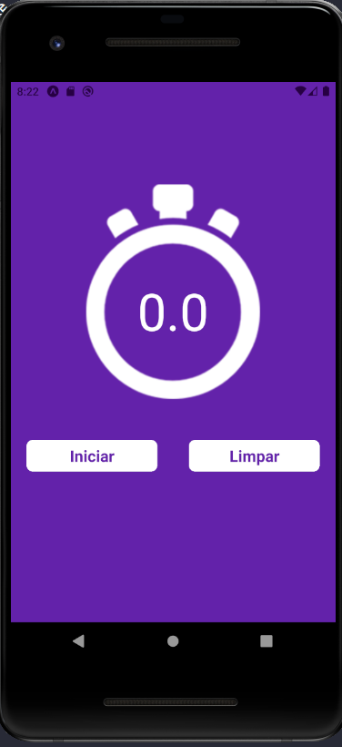
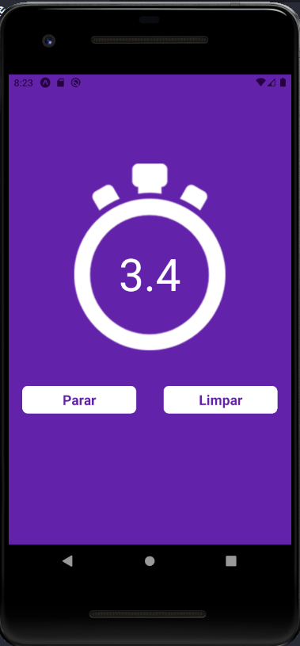
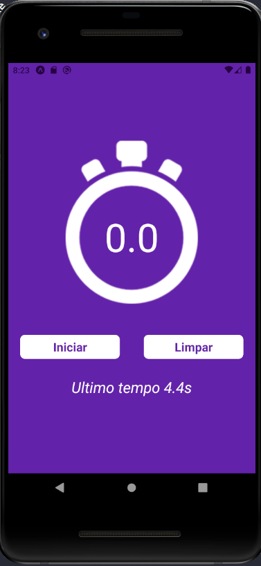

# Cronômetro React Native

## Descrição
Este é um simples aplicativo de cronômetro desenvolvido com React Native. Ele oferece funcionalidades básicas, como iniciar, pausar e limpar o cronômetro.

## Funcionalidades

- **Iniciar**: Inicia a contagem do cronômetro.
- **Pausar**: Pausa a contagem do cronômetro.
- **Limpar**: Zera o cronômetro e exibe o total da ultima contagem.

## Instalação

1. Certifique-se de ter o ambiente de desenvolvimento React Native configurado em sua máquina.
2. Clone o repositório do aplicativo para o seu ambiente local.
3. Execute o comando `npm install` para instalar as dependências.
4. Execute o aplicativo em um emulador ou dispositivo usando o comando `npx react-native run-android` ou `npx react-native run-ios`, dependendo da plataforma alvo.

## Como Usar

1. Abra o aplicativo "Cronômetro React Native".
2. Você verá a interface do cronômetro com três botões: "Iniciar", "Pausar" e "Limpar".
3. Clique no botão "Iniciar" para iniciar a contagem do cronômetro.
4. Para pausar a contagem, clique no botão "Pausar".
5. Se desejar zerar o cronômetro, clique no botão "Limpar".

## Estrutura do Projeto

- `App.js`: Arquivo principal do aplicativo que contém a lógica do cronômetro e a renderização dos componentes.

